# DIE RPG System Refactoring Plan (Approved 2025-04-02)

This plan outlines the steps to refactor the Foundry VTT system codebase (initially based on the v12 boilerplate) to accurately implement the DIE RPG ruleset.

## Summary

The plan involves three phases:
1.  **Core Mechanic Correction:** Fix the stats, implement derived data calculations (like modifiers), and update the dice rolling helper to handle d6 pools and success counting correctly.
2.  **Item & Spell Overhaul:** Redesign the data models and roll logic for Gear and Spells to remove the incorrect d20/spell level structures and implement DIE RPG mechanics (Class Dice, costs, etc.). Update the Item document class accordingly.
3.  **UI/Template Correction:** Update the Actor sheet header, redesign the Spells tab, and modify the attribute templates for Gear and Spells to match the corrected data models and mechanics.

## Plan Diagram

```mermaid
graph TD
    A[Phase 1: Core Data & Derived Stats] --> B(Adjust Stat Range);
    B --> C(Implement Derived Stats);
    C --> D(Update Actor Header Template);
    A --> E(Update Localization);

    F[Phase 2: Roll Mechanics Implementation] --> H(Refactor Dice Helper);
    H --> I(Refactor Item Roll Method);

    J[Phase 3: Class, Abilities & Items] --> K(Model Class/Persona Items);
    J --> L(Model Abilities/Powers);
    L --> M(Update Gear/Spell Data Models);
    M --> N(Update Item/Attribute Templates);
    N --> O(Redesign Spells Tab);

    subgraph "Phase 1: Core Data & Derived Stats"
        direction LR
        B --- B1(Set Stat range 0-4 in base-actor.mjs);
        C --- C1(Add prepareDerivedData in actor.mjs for Guard, Health, Willpower);
        D --- D1(Display Guard, Health, Willpower, Defense in header.hbs);
        D --- D2(Remove power/cr/xp from header.hbs);
        E --- E1(Update lang/en.json);
    end

    subgraph "Phase 2: Roll Mechanics Implementation"
        direction LR
        H --- H1(Implement pre-roll dialog/options in dice.mjs);
        H --- H2(Handle d6 pool logic, Adv/Disadv, Difficulty, Success Counting >=4, Crits, Specials in dice.mjs);
        H --- H3(Update chat message format in dice.mjs);
        I --- I1(Remove formula reliance in item.mjs);
        I --- I2(Define how items modify rolls);
        I --- I3(Call core roll logic from item.roll);
    end

    subgraph "Phase 3: Class, Abilities & Items"
        direction LR
        K --- K1(Define Class Item structure - Feature or new type?);
        K --- K2(Define Persona Item structure if needed);
        L --- L1(Define Ability/Power structure - Feature or new type?);
        M --- M1(Remove d20 structure from item-gear.mjs);
        M --- M2(Add fields for roll mods/defense to item-gear.mjs);
        M --- M3(Remove spellLevel from item-spell.mjs);
        M --- M4(Add fields for DIE RPG abilities to item-spell.mjs);
        N --- N1(Update gear.hbs template);
        N --- N2(Update spell.hbs template);
        N --- N3(Update feature.hbs template if needed for Class/Abilities);
        O --- O1(Remove spellLevel grouping in spells.hbs);
        O --- O2(Display Class/Abilities in spells.hbs);
    end

    style F fill:#f9f,stroke:#333,stroke-width:2px
    style J fill:#ccf,stroke:#333,stroke-width:2px
```

## Detailed Steps

### Phase 1: Core Data & Derived Stats
1.  **Adjust Stat Range:** Modify `module/data/base-actor.mjs` to set the initial value and range (0-4) for STR, DEX, CON, INT, WIS, CHA.
2.  **Implement Derived Stats:** Add logic to `module/documents/actor.mjs` (`prepareDerivedData`) to calculate:
    *   `system.resources.guard.max` = `system.stats.dex.value`
    *   `system.resources.health.max` = `system.stats.con.value`
    *   `system.resources.willpower.max` = `system.stats.wis.value` + `system.stats.int.value`
    *   `system.resources.defense.value` = Base 0 + contributions from items (requires item implementation first, might revisit).
3.  **Update Actor Header Template:** Modify `templates/actor/header.hbs`:
    *   Display Guard, Health, Willpower, Defense using correct `system.resources` paths.
    *   Remove references to non-existent `power`, `cr`, `xp`.
4.  **Update Localization:** Update `lang/en.json` with correct labels for stats, resources, etc., if needed.

### Phase 2: Roll Mechanics Implementation
1.  **Refactor Dice Helper (`dice.mjs`):**
    *   Implement pre-roll dialog/options (Add Class Die?, Adv/Disadv count, Difficulty, Successes Needed?).
    *   Implement core d6 pool logic: Calculate final pool size based on Stat + Class Die + Adv - Disadv.
    *   Handle the `<= 0` dice rule (roll 2d6, take lowest, allow Class Die sub).
    *   Implement success counting (`>= 4`).
    *   Implement post-roll Difficulty reduction.
    *   Implement Special activation logic (tracking 6s).
    *   Implement Critical Fail logic (0 successes + a 1).
    *   Update chat message format to clearly show pool, difficulty, successes rolled, successes after difficulty, specials triggered, final result.
2.  **Refactor Item Roll Method (`item.mjs`):**
    *   Remove reliance on `system.formula`.
    *   Determine how items (Gear, Features, Abilities) modify or trigger rolls (e.g., grant Advantage, add Class Die, have their own specific roll).
    *   Call the core roll logic from `dice.mjs` or implement similar logic within `item.roll()`, passing appropriate context (stat used, adv/disadv, etc.).
    *   Ensure Features and Abilities can be rolled (currently only outputs description).

### Phase 3: Class, Abilities & Items
1.  **Model Class/Persona Items:**
    *   Decide structure: Use 'feature' type or create new 'class'/'persona' types?
    *   Define fields needed (e.g., Class Die type, granted abilities/specials).
2.  **Model Abilities/Powers:**
    *   Decide structure: Use 'feature' type or create new 'ability' type?
    *   Define fields needed (e.g., description, cost, range, duration, effect, associated roll mods, Special text).
3.  **Update Gear/Spell Data Models:**
    *   Modify `item-gear.mjs`: Remove `system.roll` structure. Add fields for defense bonus, relevant roll modifications (e.g., grant Advantage, add dice), Special text.
    *   Modify `item-spell.mjs`: Rename to `item-ability.mjs`? Remove `spellLevel`. Add fields defined in step 2 for Abilities/Powers.
4.  **Update Item/Attribute Templates:**
    *   Update `templates/item/attribute-parts/gear.hbs` to reflect new Gear fields.
    *   Update `templates/item/attribute-parts/spell.hbs` (or rename to `ability.hbs`) to reflect new Ability fields.
    *   Update `templates/item/attribute-parts/feature.hbs` if used for Classes/Abilities.
5.  **Redesign Spells Tab:**
    *   Modify `templates/actor/spells.hbs`: Remove `spellLevel` grouping.
    *   Display Class features and Abilities/Powers, potentially grouped by source (Class, general).
    *   Update corresponding logic in `actor-sheet.mjs` (`_prepareItems`, `_getTabs`).

### Post-Refactor Task
1.  **Boilerplate Code Cleanup:** Review and remove unused example code, comments, and simplify structures inherited from the boilerplate where appropriate.