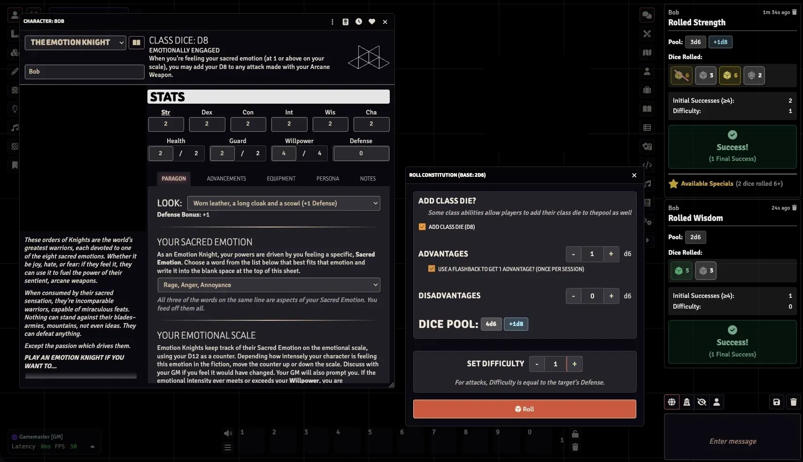
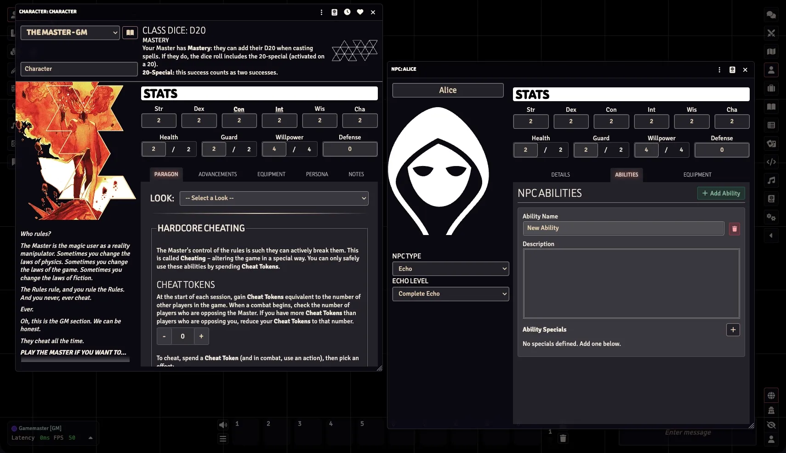
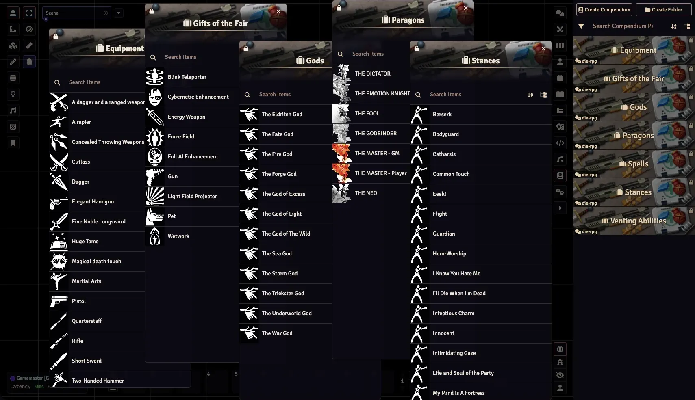

# DIE: The Roleplaying Game System (Unofficial)

> [!WARNING]
> This System is still in progress and not ready for use.

   	

    
     
    
    
     

     
     
    

   	

### An Unofficial DIE: The Roleplaying Game System for Foundry VTT

Find the books here: [DIE: The Roleplaying Game](https://rowanrookanddecard.com/product-category/game-systems/die-rpg)

This DIE RPG Package for Foundry VTT is an independent production by Joseph Hopson (ephson) and is not affiliated with Rowan, Rook and Decard or Will Kirkby. It is published under the RR&D Community License.

If you’ve enjoyed my work and find value in what I create, please consider supporting me with a small donation on [Ko-fi](https://ko-fi.com/G2G3I91JQ). I truly love what I do, and your support helps me dedicate time and resources to ongoing development. Every contribution, no matter the size, makes a difference and allows me to continue doing what I’m passionate about. Thank you for considering—it means the world to me.

## Screenshots

## How to Install
You can install the latest released version of the system by using this manifest link in Foundry VTT. [Instructions](https://foundryvtt.com/article/tutorial/): 
https://github.com/philote/die-rpg/releases/latest/download/system.json

## Features
Core Mechanics

- d6 dice pool system with 4+ success threshold
- Class Dice (d4-d20) based on paragon type
- Advantage/Disadvantage mechanics
- Critical Failures (0 successes + rolling a 1)
- Specials triggered on rolling 6s

Actor Types

- Characters - Full PC support with level progression, flashback mechanic, Fallen Mode
- NPCs - Multiple types (Paragon, Echo, Fallen, Fair, Creature) with 40+ creature subtypes

9 Item Types
- Paragon: Character classes (Dictator, Neo, Godbinder, Fool, Emotion Knight, Master, Fallen)
- Equipment: Weapons, armor, gear with defense/roll modifiers
- Look: Appearance options with defense bonuses
- Spell: Magical abilities with specials
- God: Bound deities for Godbinders (trust/debt tracking, scriptures)
- Gift: Gifts of the Fair for Neos (upgradeable)
- Stance: Combat/Social/Emotion stances for Emotion Knights
- Venting: Emotion venting abilities
- Arcane Weapon: Emotion Knight's signature weapon

Advancement System

- 20-node triangular map with SVG visualization
- Adjacent node unlocking
- Level-gated selection
- Interactive UI with tooltips

Template-Driven Paragon System

- GMs can create custom paragons without coding
- 9 dynamic field types (text, number, select, itemList, etc.)
- Custom class ability forms render on character sheets

Specials Aggregation

- Collects specials from paragon, equipment, stances, gifts, gods, spells
- State-aware (only active/equipped items contribute)
- Source tracking for each special

Character Sheet

- Tabs: Class, Advancements, Persona, Equipment, Abilities, Notes
- Interactive stat rolling
- Resource tracking with increment/decrement
- Look selection from paragon options

7 Compendium Packs

- Equipment, Paragons, Gods, Gifts, Stances, Venting Abilities, Spells

World Settings

- Failing Forward toggle
- Critical Failures toggle
- Dice Interaction mode
- Fallen Game Mode (Rituals/Campaign)

### TODO
- CodeMirror integration - Rich JSON editor for paragon form definitions (currently plain textarea)
- fix the alignment of triangles on the advancement map

# License & Acknowledgements
DIE: The Roleplaying Game for Foundry VTT is an independent production by Joseph Hopson (ephson) and is not affiliated with [Rowan, Rook, and Decard](https://rowanrookanddecard.com/), Lemon Ink Ltd, Kieron Gillen, Stephanie Hans Studio, or Stephanie Hans. It is published under the [RR&D Community License](https://rowanrookanddecard.com/rrd-community-licence). All names, characters, organisations, events, and places herein are entirely fictional, and any resemblance to actual persons, organisations, events, or places is coincidental.”

### Icon Credits
Icons used from game-icons.net and are released under a [Creative Commons Attribution 3.0 Unported license](http://creativecommons.org/licenses/by/3.0/).\
Dice 4 icon by Skoll under CC BY 3.0\
Perspective dice 6 faces 6 icon by Delapouite under CC BY 3.0\
Dice 8 faces 8 icon by Delapouite under CC BY 3.0\
Dice 10 icon by Skoll under CC BY 3.0\
Dice 20 faces 20 icon by Delapouite under CC BY 3.0\
Fencer icon by Delapouite under CC BY 3.0\
Saber and pistol icon by Delapouite under CC BY 3.0\
Glowing hands icon by Lorc under CC BY 3.0\
Scroll unfurled icon by Lorc under CC BY 3.0\
Hand of god icon by Delapouite under CC BY 3.0\
Gift trap icon by Lorc under CC BY 3.0\
High punch icon by Delapouite under CC BY 3.0\
Shouting icon by Lorc under CC BY 3.0\
Battle gear icon by Lorc under CC BY 3.0\
Thrown daggers icon by Lorc under CC BY 3.0\
Crossed sabers icon by Lorc under CC BY 3.0\
Plain dagger icon by Lorc under CC BY 3.0\
Revolver icon by Delapouite under CC BY 3.0\
Broadsword icon by Lorc under CC BY 3.0\
Spell book icon by Delapouite under CC BY 3.0\
High kick icon by Delapouite under CC BY 3.0\
Pistol gun icon by John Colburn under CC BY 3.0\
Bo icon by Delapouite under CC BY 3.0\
Winchester rifle icon by Skoll under CC BY 3.0\
Gladius icon by Skoll under CC BY 3.0\
Warhammer icon by Delapouite under CC BY 3.0\
Leather vest icon by Lorc under CC BY 3.0\
Teleport icon by Lorc under CC BY 3.0\
Cyborg face icon by Delapouite under CC BY 3.0\
Fragmented sword icon by Lorc under CC BY 3.0\
Aura icon by Lorc under CC BY 3.0\
Artificial intelligence icon by Lord Berandas under CC BY 3.0\
Ray gun icon by Lorc under CC BY 3.0\
Explosive materials icon by Lorc under CC BY 3.0\
Hound icon by Lorc under CC BY 3.0\
Cloak and Dagger icon by Lorc under CC BY 3.0