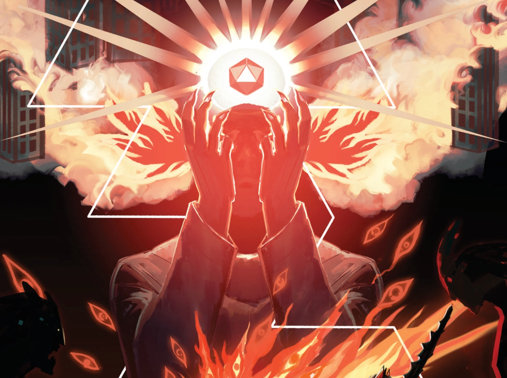

# DieRpg System

# this is a work in progress and not ready to use.

This system is a DIE RPG system.

# Credits: 
Icons used from game-icons.net and are released under a [Creative Commons Attribution 3.0 Unported license](http://creativecommons.org/licenses/by/3.0/).\
Dice 4 icon by Skoll under CC BY 3.0
Perspective dice 6 faces 6 icon by Delapouite under CC BY 3.0
Dice 8 faces 8 icon by Delapouite under CC BY 3.0
Dice 10 icon by Skoll under CC BY 3.0
Dice 20 faces 20 icon by Delapouite under CC BY 3.0

Fencer icon by Delapouite under CC BY 3.0\
Saber and pistol icon by Delapouite under CC BY 3.0\
Glowing hands icon by Lorc under CC BY 3.0\
Scroll unfurled icon by Lorc under CC BY 3.0\
Hand of god icon by Delapouite under CC BY 3.0\ 
Gift trap icon by Lorc under CC BY 3.0\
High punch icon by Delapouite under CC BY 3.0\ 
Shouting icon by Lorc under CC BY 3.0\
Battle gear icon by Lorc under CC BY 3.0\
Thrown daggers icon by Lorc under CC BY 3.0\
Crossed sabers icon by Lorc under CC BY 3.0\
Plain dagger icon by Lorc under CC BY 3.0\
Revolver icon by Delapouite under CC BY 3.0\
Broadsword icon by Lorc under CC BY 3.0\
Spell book icon by Delapouite under CC BY 3.0\
High kick icon by Delapouite under CC BY 3.0\
Pistol gun icon by John Colburn under CC BY 3.0\
Bo icon by Delapouite under CC BY 3.0\
Winchester rifle icon by Skoll under CC BY 3.0\
Gladius icon by Skoll under CC BY 3.0\
Warhammer icon by Delapouite under CC BY 3.0\
Leather vest icon by Lorc under CC BY 3.0\
Teleport icon by Lorc under CC BY 3.0\
Cyborg face icon by Delapouite under CC BY 3.0\
Fragmented sword icon by Lorc under CC BY 3.0\
Aura icon by Lorc under CC BY 3.0\
Artificial intelligence icon by Lord Berandas under CC BY 3.0\
Ray gun icon by Lorc under CC BY 3.0\
Explosive materials icon by Lorc under CC BY 3.0\
Hound icon by Lorc under CC BY 3.0\
Cloak and Dagger icon by Lorc under CC BY 3.0\